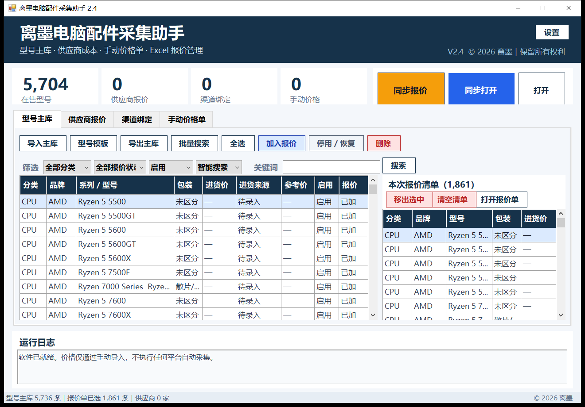
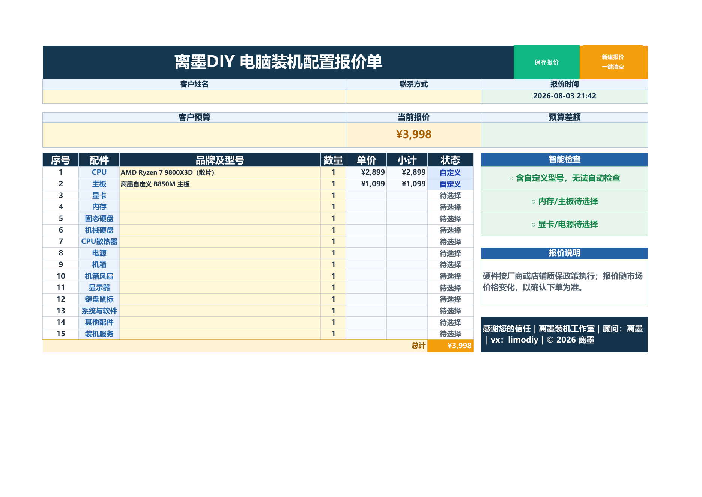

# 离墨电脑配件采集助手

Windows 桌面工具，用于管理 DIY 电脑配件型号、供应商报价、手动价格单，并同步到 Excel 宏报价单。

## 当前版本

V2.4。已取消京东及其他平台的自动采集、登录、验证和后台采集功能，只保留手动导入价格单。报价单既保留数据库型号下拉，也允许直接输入自定义型号和单价。

## 界面预览





## 快速使用

1. 在“型号主库”导入或搜索型号。
2. 在“供应商报价”导入实际进货成本。
3. 在“渠道绑定”导入 SKU、店铺或链接。
4. 在“手动价格单”导入渠道价格。
5. 点击“同步报价”写入 Excel 报价单。

报价单的“品牌及型号”可以直接输入未收录的商品。自定义型号会标记为“自定义”，兼容性区域会明确提示无法自动检查，不会误报为不兼容。

首次启动默认查找：`报价单/离墨DIY电脑装机配置报价单.xlsm`。找不到时，可在软件“设置”中重新选择报价单路径。

## 运行要求

- Windows 10/11
- Microsoft Excel（需要启用宏）
- .NET Framework 4.x
- 发布包内的 Python runtime（源码运行时可使用 Python 3.11+）

## 目录说明

- `backend.py`、`db.py`：数据和导入逻辑
- `Launcher.cs`：Windows 界面
- `build.ps1`：使用本机 .NET Framework 编译 Windows 界面
- `sync_workbook.ps1`：Excel 同步脚本
- `价格单导入模板.csv`、`渠道SKU绑定模板.csv`、`供应商报价导入模板.csv`：导入模板
- `报价单/`：发布包中的 Excel 宏报价单位置

完整操作说明见 `使用说明.txt`。

图文操作与常见问题见 [docs/使用指南.md](docs/使用指南.md)。

## 源码构建

在 Windows PowerShell 中执行：

```powershell
.\build.ps1
```

生成的程序位于 `dist/LimoPcQuoteAssistant.exe`。完整运行还需要将 Python 运行环境放在程序目录的 `runtime/` 中；普通用户建议直接下载 GitHub Releases 中的完整发布包。

发布包下载地址：[GitHub Releases](https://github.com/limonet003/limo-pc-quote-assistant/releases)

## 版权和许可

自定义界面、报价模板、数据结构和业务逻辑版权所有 © 2026 离墨。保留所有权利。
本仓库当前未授予第三方复制、修改或再发布许可；运行环境和第三方组件遵循各自许可证。
